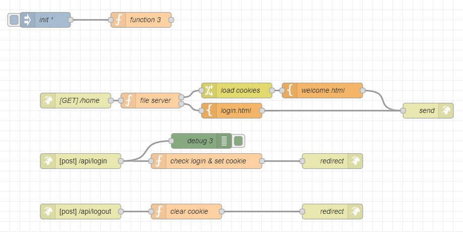

# Wie Authentifiziert man einen Benutzer:
Letzte Woche haben wir in Node-RED einen bereits existierenden Flow eingefügt, der zwei HTML-Seiten enthält: eine __welcome.html__ und eine __login.html__. Der Aufbau ist ziemlich simpel doch wir konnten alles auf der OFI seite herunterladen un din unseren flow importieren dadurch mussten wir nur noch unsere gewünschten Ändern.
 


Die Login-Funktion sucht einfach in der Datenbank nach Benutzernamen und Passwort und überprüft, ob sie übereinstimmen. Dazu wird dies in den Cookies gespeichert, daher sieht das Set-Cookie so aus:
 ```py
if (user){
    if (password== user.pw){
        msg.cookies = {
            auth: true,
            name: name
        }
    }
}
 ```

Die Login Funktion löscht einfach den cookie und leitet uns and die entscprechende seite weiter also die Wilkommensseite.

Das Programmieren in JavaScript ist fast identisch mit Python, deshalb war es für mich auf den ersten Blick ziemlich verständlich.

Dazu haben wir ganz oben eine Funktion erstellt, die als Datenbank für Benutzernamen und Passwörter dient. Sie sieht so aus:
 ```py
flow.set(
    "johnny",
    {
        pw: "qwert"
    }
)
flow.set(
    "maria",
    {
        pw: "asdf"
    }

)
return msg;
 ```
Hier wurden den Benutzern Johnny und Maria jeweils ein Passwort festgelegt. Diese werden dann beim Login überprüft. Das Problem ist jedoch, dass man ein Passwort niemals einfach so abspeichern darf. Man muss immer nur den Hashwert abspeichern, da sonst bei einem Datenleck alle Benutzernamen und Passwörter veröffentlicht werden könnten.