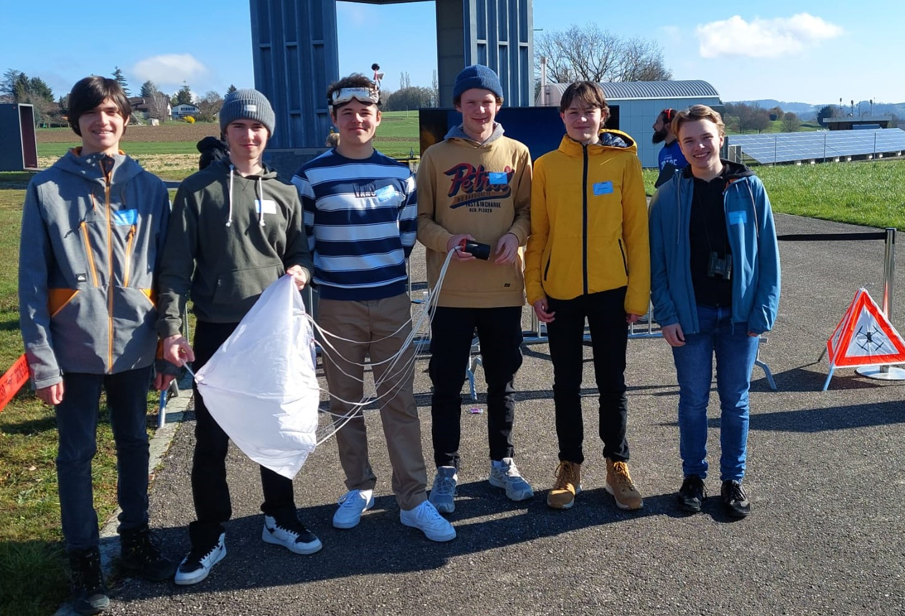
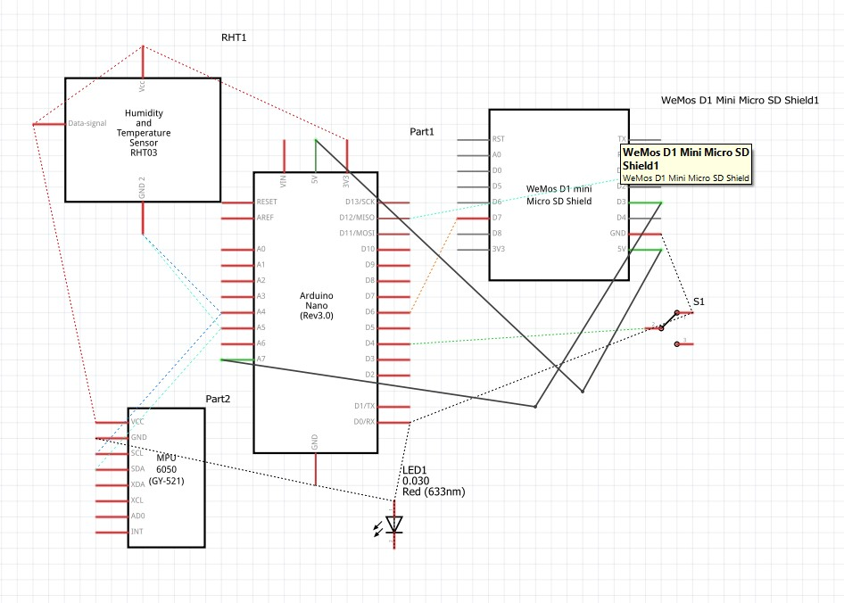
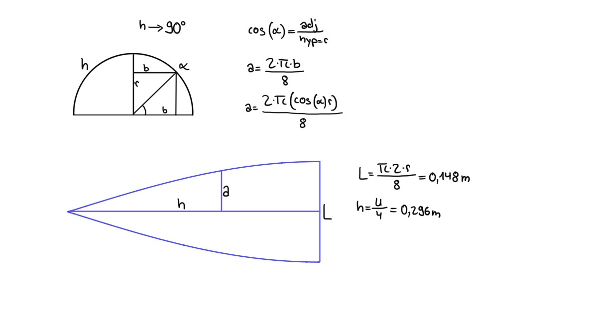
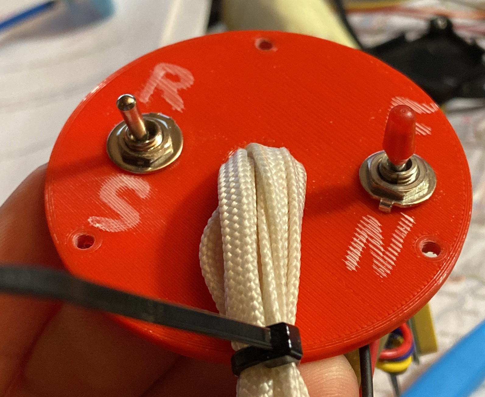
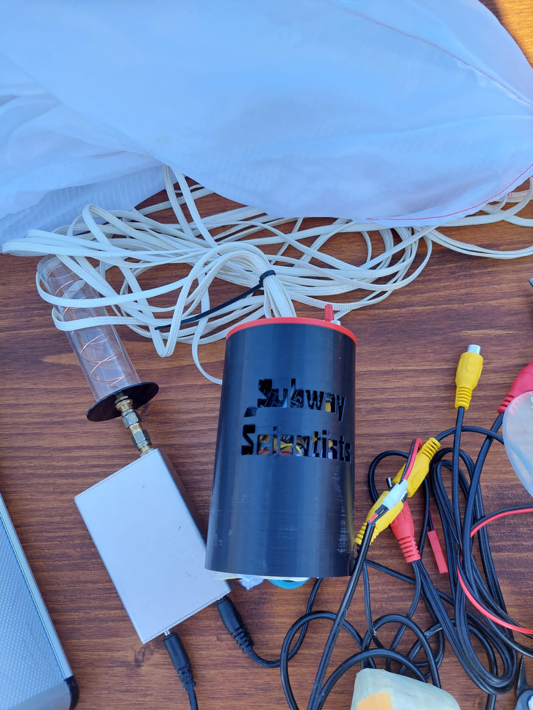
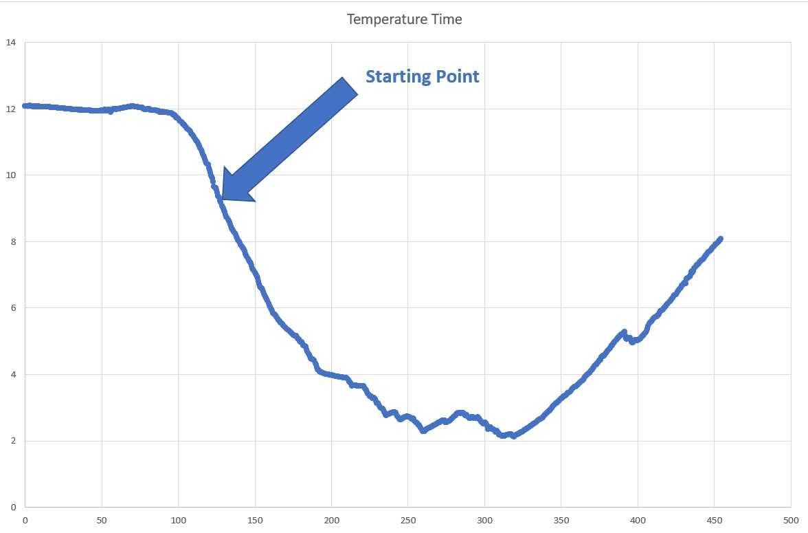
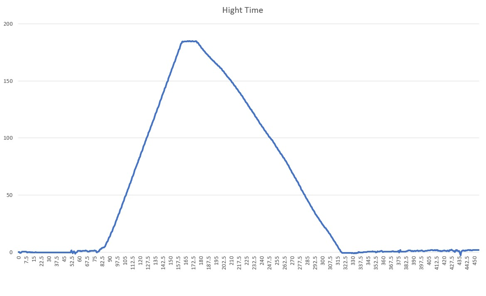

# Subway Scientists CanSat Projekt

## Wer sind wir?
Wir sind eine Gruppe von 6 Schülern aus dem Gymnasium Biel Bienne et Jura Bernois. Wir sind in der Klasse 24K, einer Phyisk und Anwendungen der Mathematik Klasse. Im letzen Herbst haben wir uns entschieden, am Cansat Wettbewerb teilzunehmen und wir sind alle sehr motiviert für dieses Projekt.

Von links nach rechts:

---

* Luis Carlos Garza Cisneros
* Miguel von Büren
* Mathieu Sprenger
* Jodok Fehlmann
* Gabriel Mariethoz
* Benjamin Bakaus

---

## Was ist CanSat kurzgefasst?

CanSat ist ein Wettbewerb, bei dem Teams aus Schülern oder Studenten die Aufgabe haben, einen miniaturisierten Satelliten in Form einer Blechdose zu entwerfen, zu bauen und zu starten. Das Ziel ist es, die Fähigkeiten der Teilnehmer im Bereich der Ingenieurwissenschaften und der Raumfahrttechnologie zu fördern und zu entwickeln.

Die Blechdose, die als Plattform für den Satelliten dient, hat eine Größe von 66x111mm und das maximale bzw. minimale Startgewicht ist auf 300 bzw. 350 Gramm festgelegt. Innerhalb dieser Grenzen müssen die Teilnehmer eine Vielzahl von Systemen und Sensoren unterbringen, die notwendig sind, um verschiedene Aufgaben zu erfüllen, wie z.B. Messung von Umweltparametern, Bildaufnahmen aus der Luft oder der Einsatz von Robotern.

Die Teilnehmer haben die Freiheit, das Design und die Funktionalität des CanSat zu bestimmen, solange es die technischen und physischen Grenzen der Plattform einhält. Die Teams müssen auch in der Lage sein, ihren Satelliten zu programmieren und zu steuern, um seine Mission zu erfüllen. Nach dem Start wird der CanSat in der Regel mit einem Fallschirm abgeworfen, um eine weiche Landung zu gewährleisten.

__Der CanSat-Wettbewerb__ bietet den Teilnehmern eine einzigartige Gelegenheit, wertvolle praktische Erfahrungen in der Raumfahrttechnologie und der Zusammenarbeit im Team zu sammeln. Es ist auch eine hervorragende Möglichkeit, ihre Fähigkeiten und ihr Wissen zu demonstrieren und ihre Karrieremöglichkeiten in der Wissenschaft und Technologie zu verbessern. Der Wettbewerb wird von verschiedenen Organisationen auf der ganzen Welt organisiert und zieht Teilnehmer aus allen Altersgruppen und Hintergründen an, die sich für Technologie und Raumfahrt interessieren.
 [__👉 CanSat ESA__](https://cansat.esa.int/)


# Blog
## Was ist unser ziel? 

Wir wollen unserem CanSat die Fähigkeit geben, die Daten, die es misst, in Echtzeit auf einen Server hochzuladen, damit man während des gesamten Fluges verfolgen kann, wo unser Satellit gerade ist und auch die gemessenen Daten sehen kann. Dies sind:

---

* Temperatur
* Druck
* Feuchtigkeit
* GPS
* Beschleunigung
---


## Elektronik
Gabriel ist zuständig für die Elektronik.
Das ist unser gesamtes Programm:
 ```c++
#include <Tiny_BME280.h>
#include <Wire.h>
#include <Adafruit_Sensor.h>
#include <MPU6050_light.h>
#include <SPI.h>
#include <SD.h>
#include <FastLED.h>

constexpr int numLeds {2};
constexpr int ledPin {5};
constexpr int buzzerPin {6};
constexpr int buttonPin {7};

/* Assign a unique ID to this sensor at the same time */
Tiny_BME280 bme;
File data;
MPU6050 mpu(Wire);
CRGB leds[numLeds] {};

float zeit{};
bool status {false};

void setup() {
  // put your setup code here, to run once:
  Serial.begin(9600);
  while (!Serial);
  Wire.begin();

  bme.begin(0x76);
  mpu.begin();
  mpu.calcOffsets(true, true);
  SD.begin(4);

  data = SD.open("data.csv", FILE_WRITE);
  delay(5000);
  if (data)
  {
    data.println("Zeit;Temperatur;Feuchtigkeit;Druck;AX;AY;AZ;GX;GY;GZ");
    data.close();
  }
  else
    Serial.println("Die Datei data.csv hat sich nicht öffnen wollen");

  FastLED.addLeds<WS2812, ledPin, GRB>(leds, numLeds);
  pinMode(buzzerPin, OUTPUT);
  digitalWrite(buzzerPin, LOW);
  pinMode(buttonPin, INPUT_PULLUP);

  Serial.println("Alle Initialisationen sind gemacht");
}

void blink()
{
  leds[0] = CRGB(255, 0, 0);
  leds[1] = CRGB(0, 0, 0);
  FastLED.show();
  digitalWrite(buzzerPin, HIGH);
  if (digitalRead(buttonPin) == 1)
    status = true;
  delay(500);

  leds[0] = CRGB(0, 0, 0);
  leds[1] = CRGB(0, 0, 255);
  FastLED.show();
  digitalWrite(buzzerPin, LOW);
  if (digitalRead(buttonPin) == 1)
    status = true;
  delay(500);
}

void loop() {
  // put your main code here, to run repeatedly:
  if (status) {
    data = SD.open("data.csv", FILE_WRITE);

    if (data)
    {
      data.print(zeit);
      data.print(";");
      data.print(bme.readTemperature());
      data.print(";");
      data.print(bme.readHumidity());
      data.print(";");
      data.print(bme.readPressure());
      data.print(";");

      mpu.update();
      data.print(mpu.getAccX());
      data.print(";");
      data.print(mpu.getAccY());
      data.print(";");
      data.print(mpu.getAccZ());
      data.print(";");
      data.print(mpu.getGyroX());
      data.print(";");
      data.print(mpu.getGyroY());
      data.print(";");
      data.print(mpu.getGyroZ());
      data.print(";");

      data.print("\n");
    }

    else
      Serial.println("Gefailed auf die SD-Karte zu schreiben");

    data.close();
    zeit += 0.5;


    if (digitalRead(buttonPin) == 0)
      status = false;
    else if (zeit > 600)
      blink();
    else if (sqrt(mpu.getAccX() * mpu.getAccX() + mpu.getAccY() * mpu.getAccY() + mpu.getAccZ() * mpu.getAccZ()) > 0.95 && sqrt(mpu.getAccX() * mpu.getAccX() + mpu.getAccY() * mpu.getAccY() + mpu.getAccZ() * mpu.getAccZ()) < 1.05 && zeit > 400)
      blink();

    delay(500);
  }

  else
    blink();
}
 ```
---
- SD-Card Module:
- VCC/+3.3: 3.3V
- GND: Digital GND
- CS: 4
- CLK: 13  SCK
- MOSI: 11 DI
- MISO: 12 DO

--- 
- BME280 Sensor:
- VCC: 5V
- GND: Analog GND
- SCL: A5
- SDA: A4
---
- LED and Buzzer:
- VCC: 5V
- GND: Digital GND
- LED: 5
- Buzzer: 6
---
- MPU:
- 3.3v
- SDA: d9
- Scl: d10
---



## Fallschirm
Wir haben aus einem alten Fallschirm von unserem Physiklehrer unseren eigenen Fallschirm genäht, Luis hat die Berechungen dafür durchgeführt, um sicherzustellen, dass der Fallschirm mit einer Geschwingigkeit von etwa 7m/s nach unten fliegt. 

In GeoGebra haben wir eine Skizze erstellt, die automatisch die richtige Form des Fallschirms berechnet. Wir haben dies mithilfe unserer oben durchgeführten Berechnungen gemacht. Auf dem ersten Hebel können wir die Anzahl der Felder ändern und auf dem anderen Hebel können wir den Radius des Fallschirms gemäß den Berechnungen ändern. Und es zeigt uns die Fläche des Feldes, die für den Fallschirm benötigt wird.


[__👉 Geogebra_Parachute__](https://www.geogebra.org/m/fgpmn9gp)


Der folgende Bericht gibt Details zu den Ergebnissen unseres selbstgemachten Fallschirms, der von Luis entworfen wurde. Unser Ziel war es, einen Fallschirm zu erstellen, der mit einer Geschwindigkeit von 5m/s sicher absteigen würde, ohne das Loch oben auf dem Schirm zu berücksichtigen. Wir haben uns bei der Berechnung der richtigen Werte und beim Nähen des Fallschirms von GeoGebra unterstützen lassen. Unser Fallschirm bestand aus acht Feldern, aber wir mussten feststellen, dass ein Feld nicht auf ein A4-Blatt passte.

Bei unserem ersten Testflug haben wir eine kleinere Version des Fallschirms eingesetzt und mussten feststellen, dass die Abstiegsgeschwindigkeit über 10 m/s betrug. Dies stellte ein kritisches Risiko für unsere Kamera dar, die beim Aufprall auf Beton hätte zerbrechen können. Um das Risiko zu minimieren, haben wir den Fallschirm neu entworfen, um einen sanfteren Abstieg zu ermöglichen.

Um den neuen Fallschirm zu testen, haben wir ihn auf einen RC-Flieger in ausreichender Größe befestigt und aus etwa 30 Metern Höhe abgeworfen. Dabei haben wir eine Abstiegsgeschwindigkeit von 5,2 m/s gemessen, was unserem Ziel sehr nahe kommt. Ein Video des Tests können Sie unter folgendem Link anschauen:
[__👉 Parachute_test__](https://youtu.be/5CryblZcecw)

## CAD zeichnnung:
Fusion 360 ist eine leistungsstarke __3D-CAD-Software__, die von Autodesk entwickelt wurde. Sie bietet ein umfangreiches Set an Werkzeugen und Funktionen, die es ermöglichen, komplexe 3D-Modelle zu erstellen und zu bearbeiten. Fusion 360 ist insbesondere für den Einsatz in der Produktentwicklung und im Maschinenbau optimiert und eignet sich sowohl für Anfänger als auch für erfahrene Nutzer. 

Für das mechanische Design haben wir uns entschieden, es in Fusion 360 zu skizzieren. Ich (Jodok) habe bereits viel Erfahrung damit. Ich habe es jetzt seit 2 Jahren im Einsatz und habe schon viele Projekte damit realisiert. Wir waren uns nicht sicher, ob wir einen Öffnungsmechanismus benötigen, also haben wir einen neuen CanSat entworfen. Jetzt ist er viel robuster und verfügt über einen Batteriehalter für unsere beiden 18650 Li-Ion-Zellen (blau), einen PCB-Halter (orange) in der Mitte. Wir haben ihn bereits auf unserem Creality Ender 3 v2-Drucker ausgedruckt. Es ist mit PLA gedruckt und hat eine Füllung von 20%. Oben gibt es Platz für das SIM 900-Modul und das GPS. Die anderen Komponenten werden direkt auf der PCB gelötet. Wir müssen noch ein Geschirr herstellen, an dem der Fallschirm befestigt wird. Möglicherweise ist der Platz für die Elektronik etwas knapp bemessen und wir müssen eine der Li-Ion-Zellen entfernen, was auch funktionieren würde und uns immer noch genügend Leistung bieten würde. Unten ist ein Foto unseres Can-Prototyps, des Dosenmodells mit allen Elektronikkomponenten und hier[__👉 3D_Design__](https://youtu.be/CeT4FryvV4w)
ist ein Video, das den Can zeigt.

# Finales Design
Unser finales Design ist auf dem beigefügten Foto zu sehen, das am Dienstag, dem 28.03.2023, dem Tag des Starts, aufgenommen wurde. Aufgrund der Abschaltung des 2G-Netzes mussten wir jedoch in der Nacht vom 27. auf den 28. noch viel Arbeit an der Elektronik leisten, da wir sie noch nicht vollständig zusammengebaut hatten. Wir mussten alles auseinandernehmen und neu aufbauen.

Am CanSat haben wir zwei Schalter angebracht, um einerseits die Videoübertragung zu aktivieren und andererseits die Aufnahmen der Sensoren auf die SD-Karte zu starten. Wir haben uns für diese Lösung entschieden, da der Video-Sender bei längerem Betrieb sehr heiß wird. Dies hatte Auswirkungen auf unsere Messungen, wie später im Blog erklärt wird.



# 28.03.2023 Start
## Diagramm Temperatur / Zeit
Unser Start verzögerte sich, da sich unser Fallschirm mit dem einer anderen Gruppe verhedderte und ein Abwurf unmöglich war. Folglich blieb unser CanSat während einer Viertelstunde eingeschaltet und erwärmte sich beträchtlich, was die Enddaten für Temperatur und Feuchtigkeit verfälschte. Die Messwerte lagen mehrere Grad über dem Normalwert. Wir haben daher die Anfangstemperatur korrigiert und die anderen Werte linear angepasst. Diese Methode erwies sich als genau, da das CanSat während des Fluges nicht noch heißer wurde. Aufgrund dessen können wir uns nicht auf absolute Werte verlassen. Wir haben 25 Grad abgezogen, aber die Kurve zeigt dennoch ein klares Bild. Die Aufstiegs- und Abstiegsdauer sind gut erkennbar. Der Temperaturunterschied zwischen 0 und 200 Metern über dem Boden beträgt etwa 6 Grad Celsius. Die Grafik zeigt dies deutlich.


## Diagramm Höhe / Zeit

Unsere Höhe-Zeit-Diagramm zeigt eine hervorragende Darstellung des Auf- und Abstiegs, wobei der Aufstieg schneller verlief als der Abstieg, da unser Fallschirm sehr langsam in der Luft war. Wir haben eine Sinkgeschwindigkeit von 1,28 m/s und eine Gesamtsinkzeit von 143 Sekunden gemessen.


# Aufnahmen:
Während des Fluges wurde das Ereignis von Miguel von Büren kommentiert und per Instagram Live aufgenommen. Das Video kann nun auf unserem Instagram-Kanal wiedergegeben werden und bietet spannende Einblicke in den Flugverlauf. Wir sind außerdem sehr zufrieden mit der Qualität unserer Onboard-Aufnahmen, die ebenfalls sehr gut geworden sind. Am Ende des Fluges konnten wir das CanSat sogar von Hand auffangen, sodass es den Boden nie berührte. Das CanSat ist noch vollständig intakt und bereit für weitere Flüge.

[__👉 Instagram-Account__](https://instagram.com/subway_scientists_scs?igshid=YmMyMTA2M2Y=)

[__👉 Onboard-Video__](https://www.youtube.com/embed/0pc0kLKa30c)

Wir möchten noch unserem neuen Sponsor danken:

## Beyond Gravity

