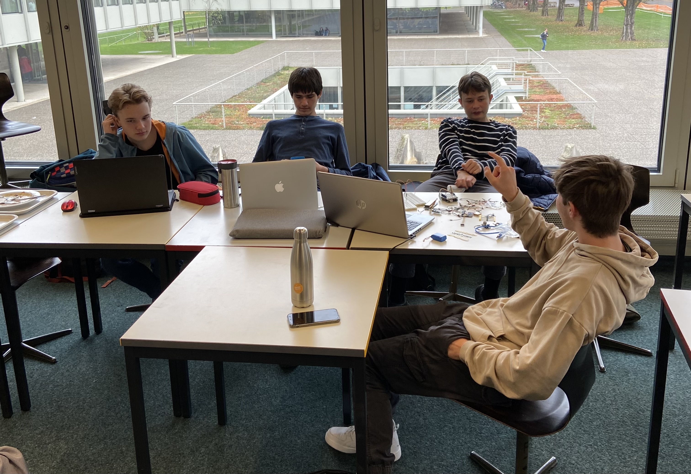

# Subway Scientists CanSat

## Wer sind wir?
Wir sind eine Gruppe von 6 Schüler aus dem Gymnasium Biel Bienne, wir sind in der Klasse 24K, einer Phyisk und anwendungen der Mathematik klasse. Im letzen herbst haben wir uns entschieden am Cansat wettbewerb teilzunehmen, wir sin dalle sehr motiviert an diesem projekt.

Von links nach rechts:

* Bejamin Backaus
* Luis Garza Cisneros Carlos
* Gabriel Mariethoz
* Miguel von Büren
* Jodok Fehlmann (nicht auf dem foto)
* Mathuieu Sprenger (nicht auf dem foto)

## Was ist CanSat kurzgefasst?

CanSat ist ein Wettbewerb, bei dem Teams aus Schülern oder Studenten die Aufgabe haben, einen miniaturisierten Satelliten in Form einer Blechdose zu entwerfen, zu bauen und zu starten. Das Ziel ist es, die Fähigkeiten der Teilnehmer im Bereich der Ingenieurwissenschaften und der Raumfahrttechnologie zu fördern und zu entwickeln.

Die Blechdose, die als Plattform für den Satelliten dient, hat eine Größe von 66x111mm und das maximale bzw. minimale Startgewicht ist auf 300 bzw. 350 Gramm festgelegt. Innerhalb dieser Grenzen müssen die Teilnehmer eine Vielzahl von Systemen und Sensoren unterbringen, die notwendig sind, um verschiedene Aufgaben zu erfüllen, wie z.B. Messung von Umweltparametern, Bildaufnahmen aus der Luft oder der Einsatz von Robotern.

Die Teilnehmer haben die Freiheit, das Design und die Funktionalität des CanSat zu bestimmen, solange es die technischen und physischen Grenzen der Plattform einhält. Die Teams müssen auch in der Lage sein, ihren Satelliten zu programmieren und zu steuern, um seine Mission zu erfüllen. Nach dem Start wird der CanSat in der Regel mit einem Fallschirm abgeworfen, um eine weiche Landung zu gewährleisten.

Der CanSat-Wettbewerb bietet den Teilnehmern eine einzigartige Gelegenheit, wertvolle praktische Erfahrungen in der Raumfahrttechnologie und der Zusammenarbeit im Team zu sammeln. Es ist auch eine hervorragende Möglichkeit, ihre Fähigkeiten und ihr Wissen zu demonstrieren und ihre Karrieremöglichkeiten in der Wissenschaft und Technologie zu verbessern. Der Wettbewerb wird von verschiedenen Organisationen auf der ganzen Welt organisiert und zieht Teilnehmer aus allen Altersgruppen und Hintergründen an, die sich für Technologie und Raumfahrt interessieren.
 [__👉 CanSat ESA__](https://cansat.esa.int/)

# Blog
### Was ist unser ziel? 
Gerne korrigiere ich die Rechtschreibung und behalte das Format bei. Hier ist der korrigierte Text:

Wir wollen unserem CanSat die Fähigkeit geben, die Daten, die es misst, in Echtzeit auf einen Server hochzuladen, damit man während des gesamten Fluges verfolgen kann, wo unser Satellit gerade ist und auch die gemessenen Daten. Das bedeutet:

* Temperatur
* Druck
* Feuchtigkeit
* GPS
* Beschleunigung

Wir möchten die Daten zur Sicherheit auch auf einer Onboard-SD-Karte speichern, denn es könnte immer etwas schiefgehen und die Daten werden aus einem unbekannten Grund nicht auf den Server hochgeladen.
## Herausforderungen:
### Elektronik
Gabriel ist zuständig fèr die elektronik.
### Fallschirm
Wir haben aus einem alten Fallschirm von unserem physik lehrer unser eigener falschirm genàht, Lui shat die berechungen dafèr durchgeeführt um sicherzustellen dass der fallschirm mit einer geschwingigkeit von etwa 7m/s nach unten fliegt. 

Dazu haben wir dann ein Geogebra Sheet erstellt auf welchem man den Radius des Fallschirms un ddie anzall ecken welche daer fallschirm haben sol eingeben kann und es gibt und dann ein bild der schablone zurück. Dies kénnen sie unter folgendem link anschauen.  

Um den Fallschirm zuu testen haben wir ihn auf einen genügend grossen RC flieger gebunden um ihn von etwa 30 meter zu testen. Dies kénnen sie unter folgendem link anschauen:

### CAD zeichnnung
Jodok hat das

  

