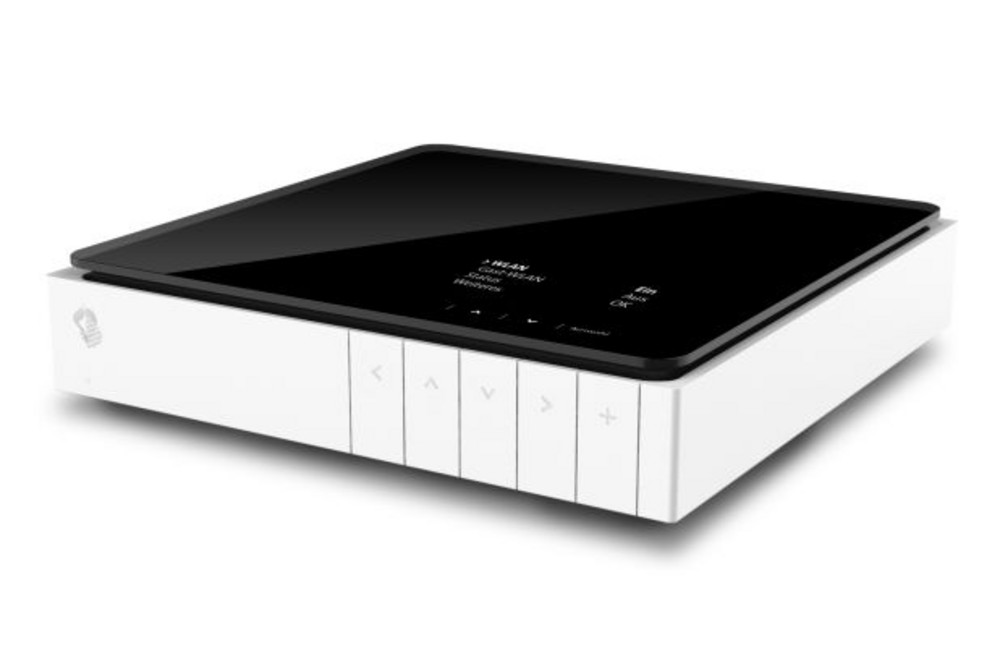
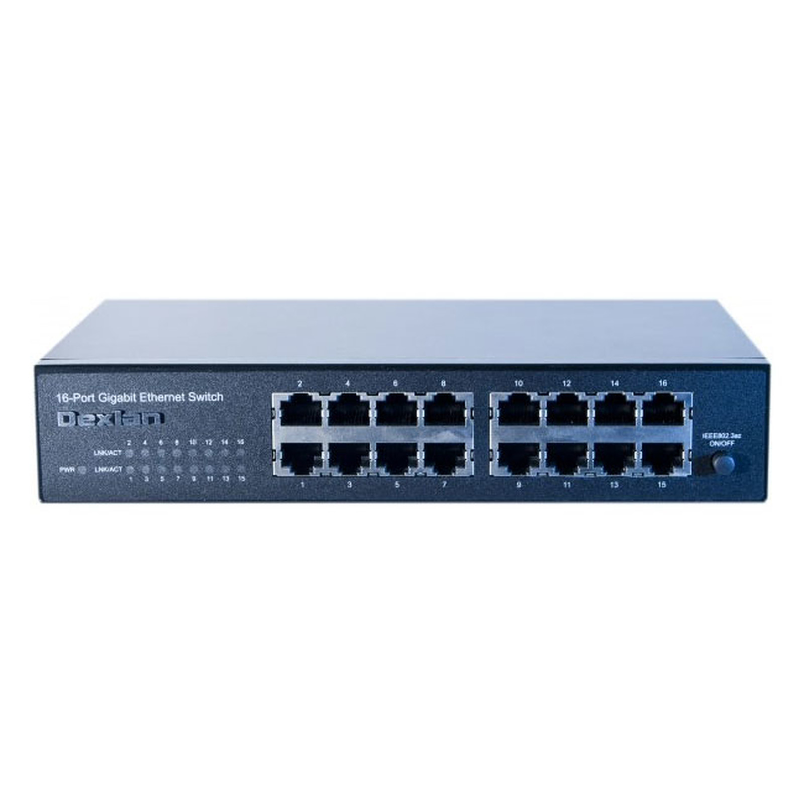

# Router

In unserem Zuhause haben wir einen Swisscom Router und einen Gigabit Ethernet Switch mit 16 Anschlüssen. Dieser Switch ist direkt mit verschiedenen RJ-45-Steckdosen in allen Zimmern des Hauses verbunden.

Am Router sind noch 2 SSD-Karten angeschlossen um eine Art Cloud Speicher zu haben.

Um in allen Zimmern des Hauses WLAN zu haben, verwenden wir 4 Mac Airport Express-Geräte, um eine gute Verbindung sicherzustellen.

