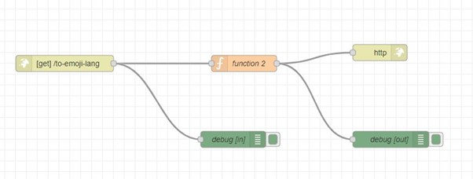

# API mit node Red erstellen 
## Vorbereitung
Als aller erstes müssen SIe sich ein [Node Red](https://nodered.org/) Konto machen. 
### Was ist Node RED?
***
    Node-RED ist ein Tool zur visuellen Programmierung von Flows. Es bietet eine grafische Oberfläche
    zum Verbinden von Nodes (das sind die kleinen kästchen die auf Abbildung 1 zu sehen sind, um
    Daten zu verarbeiten und automatisierte Abläufe zu erstellen. Es bietet die Möglichkeit, messgeräte
    u.a miteinander zu verknüpfen und zu automa􀆟sieren und wie in userem fall später dann daten zu
    sammeln. Node-RED kann Kombinabon mit verschiedenen Platformen wie Arduinos und Raspberry Pi wie zum beispiel unser kleines CO2 messgerät verwendet werden.
  
Es wäre auch von Vorteil wenn sie sich [Post Man](https://www.postman.com/downloads/https://www.postman.com/downloads/) istalieren um dann später eine Http Anfrage senden zu können. 

### Was ist Postman?
***
    Postman ist eine Software anwendung zur Erstellung, Verwaltung und Testung von APIs. Es bietet eine
    benutzerfreundliche Oberfläche zum Senden von HTTP-Anfragen an eine API und zum Anzeigen der
    Antwort. Es ermöglicht Entwicklern, schnell API-Endpoints zu testen und zu debuggen, indem sie
    Anfragen und Antworten in einer visuellen Umgebung anzeigen.

## Wie erstellt man nun eine API mit den beiden Programmen
***
    Wir haben eine API erstellt die einen Text zu emojis Umwandelt, das haben wir wir Postman gemacht und Node Red gemacht. 
    Auf Node Red haben wir das mit einzelnen Nodes gemacht, das sieht dann etwa so aus:


und der Code in der Funktions so:


```
let emoji = msg.payload.text;

emoji = emoji.replace(/hello/, '👋');

msg.payload = {
    msg: emoji
};

return msg;
