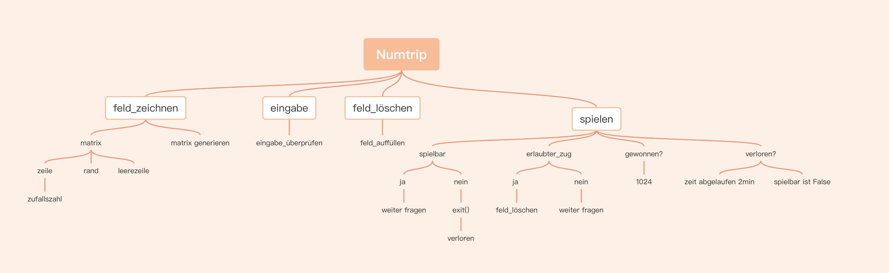

# Numtrip-Blog

## Ziel des Spiels:

In diesem Spiel geht es darum, eine möglichst hohe Zahl in einem Feld zu erreichen, mit der Einschränkung, dass man nur ein Feld verdoppeln kann, wenn es ein Nachbarfeld mit dem gleichen Wert gibt. Das macht das Spiel ziemlich schwierig in gewissen Situationen. Es ist vergleichbar mit dem 2048 Spiel, welches fast jeder kennt.

# Umsetzung des Spiels
Die Voraussetzungen halten sich bei diesem Spiel in Grenzen. Das Einzige, was man braucht, ist Python, das auf seinem Computer installiert ist. Hier der Link zum Herunterladen: https://www.python.org/downloads/
Da das Spiel nur im Terminal läuft, ist dies die einzige Installation, die es braucht, um es spielen zu können.

## Spielfeld Gezeichnet

Als Hausaufgabe habe ich mein Spielfeld "gezeichnet", das so aussieht:
```py
      1      2      3      4      5
  +------+------+------+------+------+
  ¦      ¦      ¦      ¦      ¦      ¦
1 ¦   2  ¦  32  ¦  16  ¦   8  ¦   8  ¦
  ¦      ¦      ¦      ¦      ¦      ¦
  +------+------+------+------+------+
  ¦      ¦      ¦      ¦      ¦      ¦
2 ¦   4  ¦  26  ¦   8  ¦   2  ¦   1  ¦
  ¦      ¦      ¦      ¦      ¦      ¦
  +------+------+------+------+------+
  ¦      ¦      ¦      ¦      ¦      ¦
3 ¦   4  ¦   4  ¦  16  ¦   4  ¦   2  ¦
  ¦      ¦      ¦      ¦      ¦      ¦
  +------+------+------+------+------+
  ¦      ¦      ¦      ¦      ¦      ¦
4 ¦   2  ¦   8  ¦   1  ¦   4  ¦   1  ¦
  ¦      ¦      ¦      ¦      ¦      ¦
  +------+------+------+------+------+
  ¦      ¦      ¦      ¦      ¦      ¦
5 ¦   2  ¦   4  ¦   4  ¦   4  ¦   4  ¦
  ¦      ¦      ¦      ¦      ¦      ¦
  +------+------+------+------+------+
```
Ich habe das Design einfach mit einzelnen Funktionen erstellt, die zum Beispiel den oberen Rand oder eine Zwischenzeile zeichnen. Ich bin sehr zufrieden mit meinem Design.

## Erstes Interaktives Element Hinzugefügt:

### Eingabe Funktion:
Als Hausaufgabe habe ich das erste interaktive Element zu unserem Spiel Numtrip hinzugefügt. Mit diesem Element kann man ein Feld auswählen, indem man eine x,y-Koordinate eingibt.

```py
def eingabe():
    x,y=input("Welches Feld soll geleert werden: ").split()
    return int(x),int(y)
```
 Ich habe die Funktion erstellt, die den Benutzer nach zwei Zahlen fragt. Die Benutzer gibt die Zahlen durch Trennung mittels eines Kommas ein. Mit der Methode `.split()` am Ende des Inputs kann ich die beiden Zahlen aufteilen, ohne den Benutzer zweimal zu fragen. Das Return am Schluss wandelt die eingegebenen Strings in integers um.

### Werte Leeren in der Matrix:

Meine Idee war, dass ich eine -1 in die Matrix schreibe an der Stelle, wo der Benutzer das Feld leeren soll. Später mache ich einfach beim Print-Befehl, dass falls es eine negative Zahl ist, es einen Leerschlag macht, um die Zahl zu löschen. Das sieht dann etwa so aus
```py
zahlen_matrix[x-1][y-1]=-1
```
```py
if (zahl<0):
            print(" ",end = '')
```
### Rundum Werte leeren des Spielfeldes:

Dies ist der erste Algorithmus, den ich programmiert habe. Er speichert zuerst den Wert des Feldes in der Variablen wert. Danach schaut er, welches Feld rundum den selben Wert hat und springt zu diesem Feld und geht diese ganze Prozedur noch einmal durch, um alle möglichen Nachbarfelder auch aufzudecken. Dieser Abschnitt könnte etwa so aussehen:
```py
def feld_loeschen(x,y):

    if zahlen_matrix[x-1][y]== wert:
        zahlen_matrix[x-1][y]=-1
        feld_loeschen(x-1,y)
    if x < 4 and zahlen_matrix[x+1][y]== wert:
        zahlen_matrix[x+1][y]=-1
        feld_loeschen(x+1,y)
    if y <4 and zahlen_matrix[x][y+1]== wert:
        zahlen_matrix[x][y+1]=-1
        feld_loeschen(x,y)
    if zahlen_matrix[x][y-1]== wert:
        zahlen_matrix[x][y-1]=-1
        feld_loeschen(x,y-1)
```
Hier wird einfach die Funktion `feld_loeschen`aufgerufen mit der neuen Position des Spielfelds. 

## Zahlen rundum wieder auffüllen

Nun müssen wir von der gelöschten Position aus alle anderen Kästchen, die das ausgewählte berühren, auch noch leeren. Diese müssen später wieder aufgefüllt werden. Mein Vorgehen ist, dass ich von unten links anfange, die ganze Matrix durchzugehen und zu überprüfen, ob der Wert der Position gleich -1 ist, was bei mir einer leeren Zelle entspricht. Dies könnte etwa so aussehen: 
``` py
def feld_auffuellen():
    for j in range(5):
        for i in range (4,0,-1):
            if zahlen_matrix[i][j] == -1:
                ip=i
                weitersuchen=True
                while (ip > 0 and weitersuchen):
                    ip=ip-1
                    if zahlen_matrix[ip][j] > 0:
                        weitersuchen = False
                if weitersuchen:
                    zahlen_matrix[i][j]= 2**(int(random.random()*4))
                else:
                    tmp = zahlen_matrix[i][j]
                    zahlen_matrix[i][j] = zahlen_matrix[ip][j]
                    zahlen_matrix[ip][j] = tmp

        if zahlen_matrix[0][j] == -1:
            zahlen_matrix[0][j] = 2**(int(random.random()*4))
```
Dazu wird auch noch gerade die obere Spalte immer, falls sie leer ist mit Zufallszahlen generiert. 

## Ist es überhaupt spielbar?

Wir müssen unbedingt, bevor der Spieler erneut spielen kann, überprüfen, ob es überhaupt spielbar ist. Das heißt, man muss schauen, ob es mindestens ein Feld gibt, welches rechts, links, oben oder unten denselben Wert hat, wie das aktuelle Feld. Dieser Teil des Codes ist mit der Funktion `spielbar()` gemacht. Der Code selbst würde vermutlich ähnlich wie die obigen Beispiele aussehen, indem es durch die Matrix geht und prüft, ob es Nachbarfelder mit demselben Wert gibt. 

## Ist der ausgewählte zug erlaubt?

Ein weiterer wichtiger Schritt ist auch zu überprüfen, ob der Spieler ein erlaubtes Feld ausgewählt hat. Er darf nur ein Feld wählen, welches auch mindestens auf einer Seite ein Feld desselben Werts existiert. Dies wird mit der Funktion `erlaubter_zug()` überprüft. Diese könnte etwa so aussehen:
```py
def erlaubter_zug(x, y):
    # check_up
    if x > 0:
        if zahlen_matrix[x - 1][y] == zahlen_matrix[x][y]:
            return True
    # check_down
    ...
```
etc... sie checkt dann noch alle anderen Seiten.


## Gewonnen!!!

Bei mir hat der Spieler gewonnen, wenn er es innerhalb von 2 Minuten geschafft hat, mindestens ein Feld auf `1024` zu bringen. Dieses Ziel ist erreichbar, aber man muss gut im Spiel sein, um es zu erreichen.
Dies könnte man z.B. mit einer Timer-Funktion tracken und am Ende des Spiels überprüfen, ob das Ziel erreicht wurde.


# Herausforderungen und Tipps:
## Herausforderungen
Manchmal hat es etwas Zeit gebraucht bis alles ging aber grosse Herausforderungen gab es keine. Manchmal habe ich den Lehrer um einen Tipp gefragt und es ging dann immer. 

## Tipps an andere EF_Schüler:

Mein haupt Tipp wäre immer der Lektion etwas im voraus zu sein, damit man am Schluss nicht in den Stress kommt und halt Zuhause auch arbeiten. Den grösstem Teil habe ich Zuhause geschrieben da ich in den Lektionen unfähig bin Effizient zu arbeiten haha. Das Liegt aber warschweinlich hauptsächlich an mir.

## Top-Down entwurf


